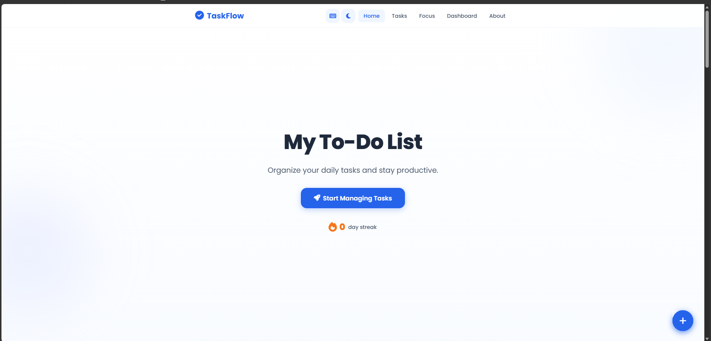
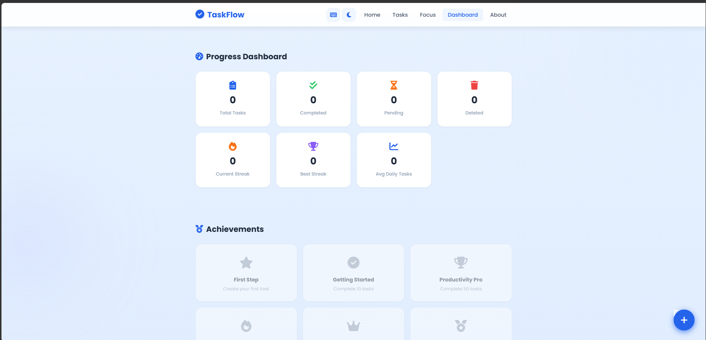
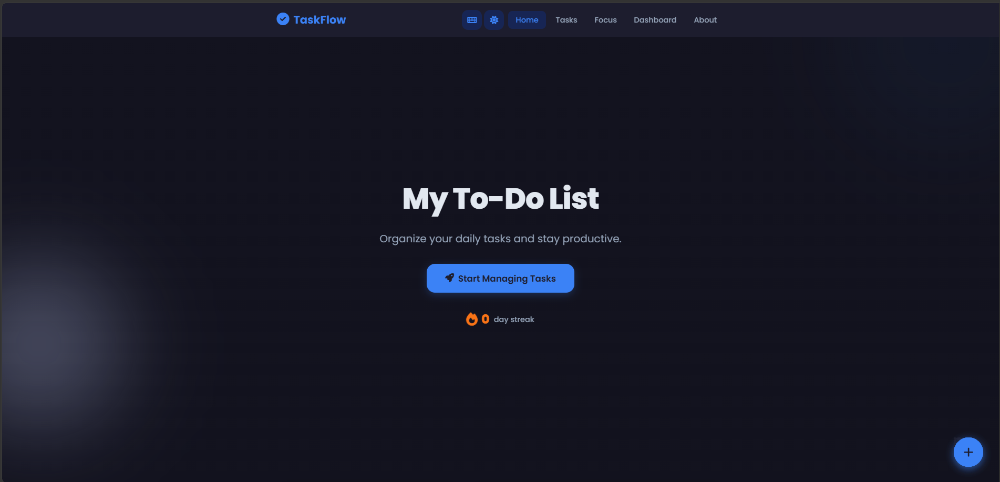
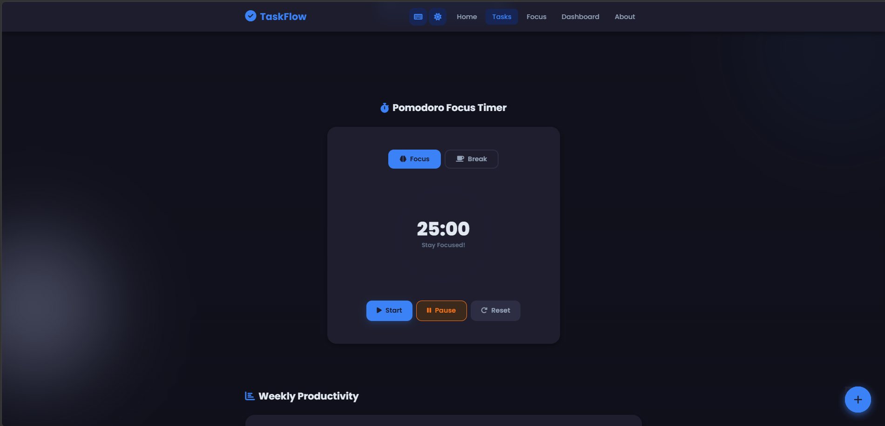
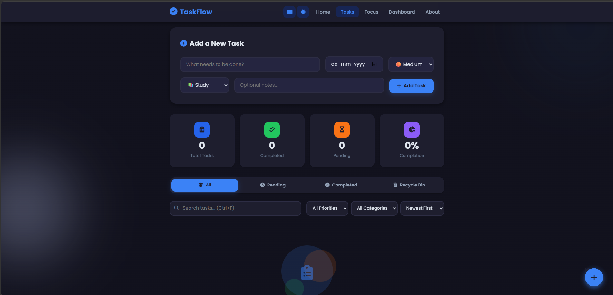
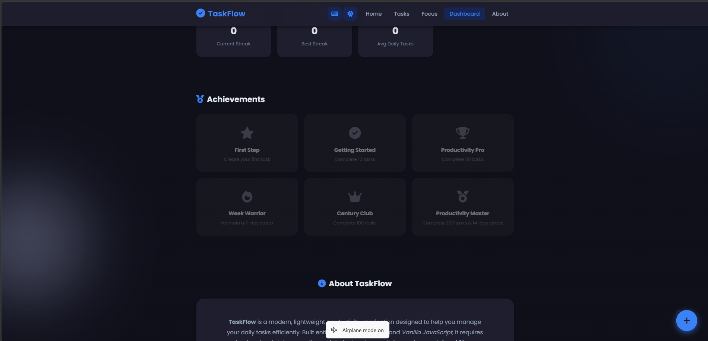

<div align="center">

# ✅ TaskFlow

### A Modern, Feature-Rich To-Do List Web Application

**Organize your daily tasks and stay productive — right in your browser.**

TaskFlow is a fully-featured productivity application built with **pure HTML5, CSS3, and Vanilla JavaScript**. No frameworks, no build tools, no backend — just clean, modular code and a polished user interface that rivals apps like Todoist and Microsoft To Do.

---

<!-- BADGES -->

[](https://developer.mozilla.org/en-US/docs/Web/HTML)
[](https://developer.mozilla.org/en-US/docs/Web/CSS)
[](https://developer.mozilla.org/en-US/docs/Web/JavaScript)
[](https://developer.mozilla.org/en-US/docs/Web/API/Window/localStorage)
[]()
[](https://om-aloni.github.io/TaskFlow/)
[]()
[](https://github.com/OM-ALONI/TaskFlow/blob/main/LICENSE)

---

</div>

## 📑 Table of Contents

- [About](#-about)
- [Live Demo](#-live-demo)
- [Features](#-features)
- [Screenshots](#-screenshots)
- [Folder Structure](#-folder-structure)
- [Installation](#-installation)
- [Technologies Used](#-technologies-used)
- [Project Highlights](#-project-highlights)
- [Keyboard Shortcuts](#-keyboard-shortcuts)
- [Browser Support](#-browser-support)
- [Future Improvements](#-future-improvements)
- [Contributing](#-contributing)
- [License](#-license)
- [Author](#-author)

---

## 📌 About

**TaskFlow** is a complete, production-quality task management application designed to help users organize their daily work efficiently — entirely from the browser. It combines a clean, modern interface with powerful productivity features like a Pomodoro timer, streak tracking, achievement badges, and a detailed analytics dashboard.

The project demonstrates proficiency in **front-end development** using only vanilla web technologies — no React, no Vue, no Bootstrap, no Tailwind. Every pixel, animation, and interaction is hand-crafted.

> 💡 All user data is persisted using the browser's **Local Storage API**. No server, no database, no internet required.

---

## 🌐 Live Demo

<div align="center">

### [🚀 Click Here to Try TaskFlow Live](https://om-aloni.github.io/TaskFlow/)

<a href="https://om-aloni.github.io/TaskFlow/" target="_blank">
  
</a>

</div>

---

## ✨ Features

### Core Task Management
| Feature | Description |
|---------|-------------|
| ✅ **Add Tasks** | Create tasks with title, due date, priority, category, and notes |
| ✏️ **Edit Tasks** | Inline editing — click Edit, modify the title, press Enter to save |
| 🗑️ **Delete Tasks** | Tasks move to the Recycle Bin instead of being permanently removed |
| ✔️ **Complete Tasks** | Mark tasks as done with a visual strikethrough effect |
| 🔄 **Restore Tasks** | Bring back completed or deleted tasks from the Recycle Bin |
| 🔍 **Search** | Real-time keyword search across task titles and notes |
| 🏷️ **Filter by Priority** | View only High, Medium, or Low priority tasks |
| 📂 **Filter by Category** | Personal, Study, Work, Shopping, Health, or Other |
| 🔀 **Sort Tasks** | Newest, Oldest, Alphabetical, or by Priority |
| 📑 **Tab Navigation** | Switch between All, Pending, Completed, and Recycle Bin views |

### Productivity Tools
| Feature | Description |
|---------|-------------|
| 🍅 **Pomodoro Timer** | 25-minute focus / 5-minute break with circular progress animation and audio alarm |
| 📅 **Calendar Widget** | Displays today's date, day, month, and daily task summary |
| 💬 **Motivational Quotes** | 34 curated productivity quotes with a "New Quote" button |
| 🔥 **Streak Counter** | Tracks consecutive days of task completion with fire icon |
| 🏆 **Achievement Badges** | 6 unlockable badges — from "First Step" to "Productivity Master" |
| 📊 **Progress Dashboard** | 7 analytics cards: Total, Completed, Pending, Deleted, Streaks, and Averages |
| 📈 **Weekly Chart** | Pure CSS/JS bar chart showing completed tasks per weekday |
| 📉 **Daily Progress Bar** | Animated bar showing overall completion percentage |

### User Experience
| Feature | Description |
|---------|-------------|
| 🌙 **Dark Mode** | Full dark theme with smooth fade transitions, persisted in Local Storage |
| 🖱️ **Drag & Drop** | Reorder pending tasks by dragging cards up or down |
| ⌨️ **Keyboard Shortcuts** | `Ctrl+N`, `Ctrl+F`, `Ctrl+D`, `Escape` — with a help popup |
| 📝 **Task Notes** | Optional expandable notes on each task card |
| 🔔 **Toast Notifications** | Animated slide-in alerts for every action |
| 🗑️ **Recycle Bin** | Soft-delete with 30-day auto-expiry and manual empty option |
| ⏳ **Loading Screen** | Animated logo + spinner on initial page load |
| 🫧 **Floating Action Button** | Quick-access button to jump to task creation |
| 🎨 **Smooth Animations** | Card hover lifts, button ripples, slide-ins, and number counters |
| 📱 **Fully Responsive** | Adapts seamlessly from desktop to tablet to mobile |
| 🍔 **Hamburger Menu** | Collapsible navigation on small screens |
| ⬆️ **Back to Top** | Scroll-to-top button that appears on scroll |
| 🎭 **Empty State** | Friendly animated illustration when no tasks exist |
| 🛡️ **XSS Protection** | User input is escaped before rendering to the DOM |
| ♿ **Accessibility** | Semantic HTML, ARIA labels, keyboard navigation, focus outlines |

---

## 📸 Screenshots

<div align="center">

| | |
|:---:|:---:|
|  |  |
| *Home Page with Calendar & Quote* | *Progress Dashboard & Statistics* |

| | |
|:---:|:---:|
|  |  |
| *Dark Mode Theme* | *Pomodoro Focus Timer* |

| | |
|:---:|:---:|
|  |  |
| *Task Cards with Drag & Drop* | *Achievement Badges* |

> 📁 *Screenshots will be added to the `images/` directory.*

</div>

---

## 📁 Folder Structure

```
TaskFlow/
│
├── index.html          # Semantic HTML5 structure (516 lines)
├── styles.css          # Complete CSS with light/dark themes (2,107 lines)
├── script.js           # Vanilla JavaScript logic (1,179 lines)
│
├── images/             # Screenshots and assets
│   ├── home.png
│   ├── dashboard.png
│   ├── dark-mode.png
│   ├── pomodoro.png
│   ├── tasks.png
│   └── achievements.png
│
├── LICENSE             # MIT License
└── README.md           # This file
```

**Total:** ~3,800 lines of hand-written code across 3 files.

---

## 🛠️ Installation

### Run Locally

```bash
# 1. Clone the repository
git clone https://github.com/OM-ALONI/TaskFlow.git

# 2. Navigate to the project folder
cd TaskFlow

# 3. Open in your browser
#    Simply double-click index.html, or use a local server:

# Option A: Python
python -m http.server 8000

# Option B: Node.js (npx)
npx serve .

# Option C: VS Code
#    Right-click index.html → "Open with Live Server"

# 4. Open your browser
#    Navigate to http://localhost:8000
```

### Deploy on GitHub Pages

```bash
# 1. Push your code to GitHub
git add .
git commit -m "Initial commit"
git push origin main

# 2. Go to your repository on GitHub
#    Settings → Pages → Source → Select "main" branch → / (root)

# 3. Your site will be live at:
#    https://<your-username>.github.io/TaskFlow/
```

> ⚡ **No build step required.** TaskFlow runs directly in the browser — just open `index.html`.

---

## 💻 Technologies Used

| Technology | Purpose |
|------------|---------|
| **HTML5** | Semantic structure, accessibility attributes, ARIA roles |
| **CSS3** | Styling, CSS variables, Grid, Flexbox, animations, transitions |
| **JavaScript (ES6+)** | Application logic, DOM manipulation, event handling |
| **Local Storage API** | Persistent data storage — tasks, theme, achievements, streaks |
| **Web Audio API** | Pomodoro timer alarm sound generation |
| **Google Fonts** | Poppins typeface for modern typography |
| **Font Awesome 6** | Icons for UI elements |
| **GitHub Pages** | Free static site hosting and deployment |

> 🚫 **No frameworks used** — No React, Vue, Angular, Bootstrap, Tailwind, or jQuery.

---

## 🏗️ Project Highlights

### Why Local Storage Instead of a Database?

TaskFlow intentionally uses the browser's **Local Storage API** for data persistence. This design choice offers several advantages:

| Benefit | Explanation |
|---------|-------------|
| 🔒 **Privacy** | All data stays on the user's device — nothing is sent to a server |
| ⚡ **Speed** | Instant read/write with zero network latency |
| 🌐 **Offline** | Works without an internet connection after first load |
| 🆓 **Cost** | No database hosting, API costs, or infrastructure to maintain |
| 🛠️ **Simplicity** | Zero setup — just open the HTML file and start using it |

### No Backend Required

TaskFlow is a **100% client-side application**. There is no server, no API, no authentication flow, and no database. The entire application lives in three files and runs in any modern browser.

### Data Storage

All user data — including tasks, deleted tasks, achievements, theme preferences, and streak data — is serialized as JSON and stored in `localStorage`. The application automatically loads this data on every page visit, ensuring nothing is lost between sessions.

---

## ⌨️ Keyboard Shortcuts

| Shortcut | Action |
|----------|--------|
| `Ctrl + N` | Focus the task input field |
| `Ctrl + F` | Focus the search bar |
| `Ctrl + D` | Toggle Dark / Light mode |
| `Enter` | Quick-add a task (when input is focused) |
| `Escape` | Close modals, cancel editing |

> 💡 A shortcuts help popup is available via the keyboard icon in the navigation bar.

---

## 🌍 Browser Support

| Browser | Supported |
|---------|:---------:|
| Google Chrome | ✅ Yes |
| Mozilla Firefox | ✅ Yes |
| Microsoft Edge | ✅ Yes |
| Apple Safari | ✅ Yes |
| Opera | ✅ Yes |
| Internet Explorer | ❌ No |

> TaskFlow uses modern CSS and JavaScript features (CSS Grid, Custom Properties, `localStorage`, `Web Audio API`) that are supported in all evergreen browsers.

---

## 🚀 Future Improvements

| Feature | Status |
|---------|:------:|
| 🔐 User Authentication (Sign Up / Login) | 🔜 Planned |
| ☁️ Cloud Sync across devices | 🔜 Planned |
| 🔔 Push Notifications & Reminders | 🔜 Planned |
| 📆 Google Calendar Integration | 🔜 Planned |
| 📲 PWA Support (installable on mobile) | 🔜 Planned |
| 🔁 Recurring Tasks | 🔜 Planned |
| 📎 Subtasks & Checklists | 🔜 Planned |
| 📤 Export / Import Tasks (JSON, CSV) | 🔜 Planned |
| 👥 Team Collaboration & Shared Lists | 🔜 Planned |
| 📊 Advanced Analytics & Reports | 🔜 Planned |

---

## 🤝 Contributing

Contributions are welcome! Here's how you can help:

1. **Fork** the repository
2. **Create** a feature branch: `git checkout -b feature/amazing-feature`
3. **Commit** your changes: `git commit -m 'Add amazing feature'`
4. **Push** to the branch: `git push origin feature/amazing-feature`
5. **Open** a Pull Request

Please ensure your code follows the existing style and includes comments for new functions.

---

## 📄 License

This project is licensed under the **MIT License** — see the [LICENSE](LICENSE) file for details.

```
MIT License

Copyright (c) 2025 Om Aloni

Permission is hereby granted, free of charge, to any person obtaining a copy
of this software and associated documentation files (the "Software"), to deal
in the Software without restriction, including without limitation the rights
to use, copy, modify, merge, publish, distribute, sublicense, and/or sell
copies of the Software, and to permit persons to whom the Software is
furnished to do so, subject to the following conditions:

The above copyright notice and this permission notice shall be included in all
copies or substantial portions of the Software.

THE SOFTWARE IS PROVIDED "AS IS", WITHOUT WARRANTY OF ANY KIND.
```

---

## 👨‍💻 Author

<div align="center">

### Om Aloni

**Full-Stack Developer**

[](https://github.com/OM-ALONI)
[](https://www.linkedin.com/in/om-anil-badgujar/)


</div>

---

<div align="center">

---

### ⭐ If you like this project, consider giving it a star on GitHub!

**[🌟 Star this Repository](https://github.com/OM-ALONI/TaskFlow)**

Made with ❤️ by **Om Aloni**

---

</div>
